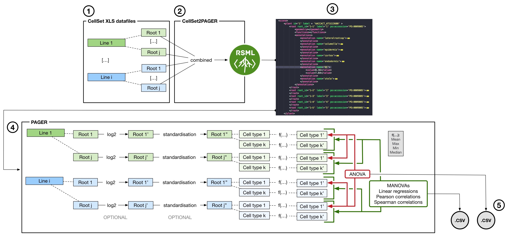
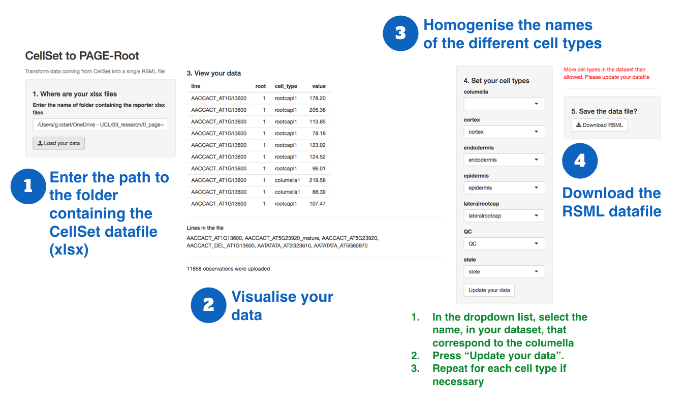

# Using PAGE-Root

<small>Overview of the PAGE-Root pipeline</small>

1. [Requirements](#requirements)
2. [CellSet2PAGER](#cellSet2pager)
3. [PAGE-Root](#page-root)

---

## Requirements

PAGE-Root (or PAGER) is a app developped using R and the Shiny framework. Therefore, R need to be install to be able to run the app. We recommand to install [RStudio](https://www.rstudio.com/)

## CellSet2PAGER

The first step in the analysis is to transform the output data from CellSet into an RSML file that can be read by PAGE-Root. 

The CellSet data should be organised in separated Excell files, one per genotype. Each repetition of the genotype will be contained in a different sheet of the file. And example of CellSet output file can be [found here](/docs/cellset.xlsx). 

To process the CellSet data and compile then in a single RSML (Root System Markup Language) file, you can use the Cellset2Pager shiny app. The code the app is [available here](https://github.com/PAGERoot/CellSet-PAGER). 

To launch the app, enter the following command in your R console:

	library(shiny)
	shiny::runGitHub("PAGERoot/CellSet-PAGER", "PAGERoot") 

PAGE-Root accepts only specific cell types:

- columella
- cortex
- endodermis
- epidermis
- lateralrootcap
- QC
- stele

 Therefore, the CellSet2Pager app allows you to homogenize the names of the different cell types in your dataset. For each cell type, choose in the dropdown menu thet corresping cell type name in your data file. When you press `Update your data`, the name will be changed in your datafile. 

 Once all your celltypes are correct, you will be able to download the compiled RSML file. 

 > The easiest way is of course to use the correct cell types directly in CellSet.

## PAGE-Root