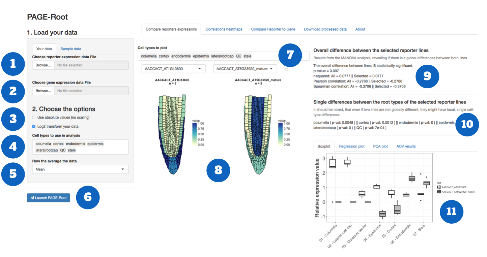
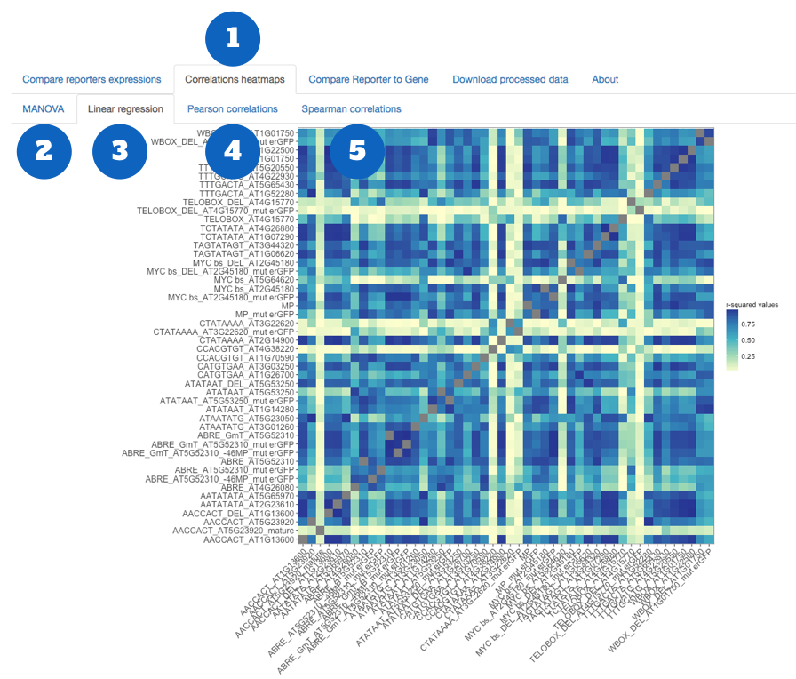
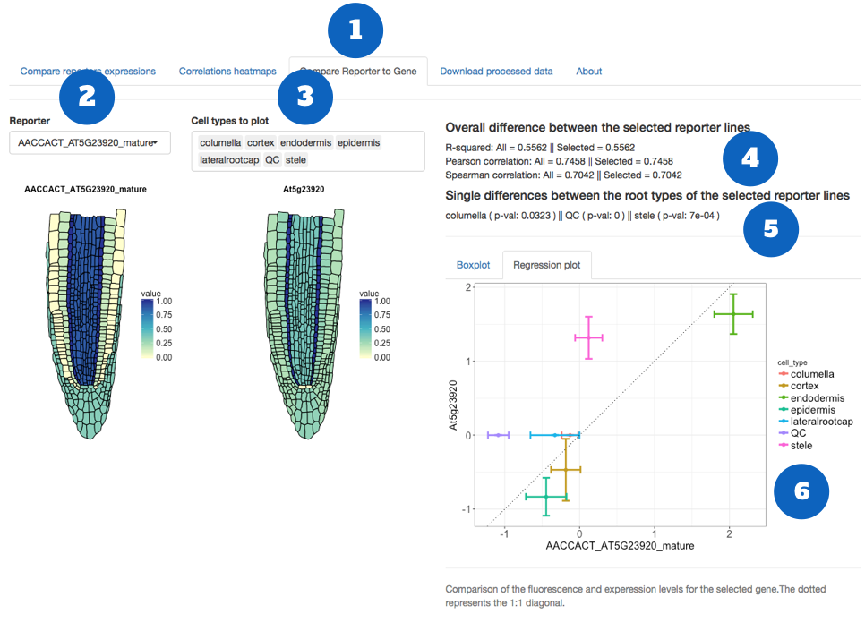
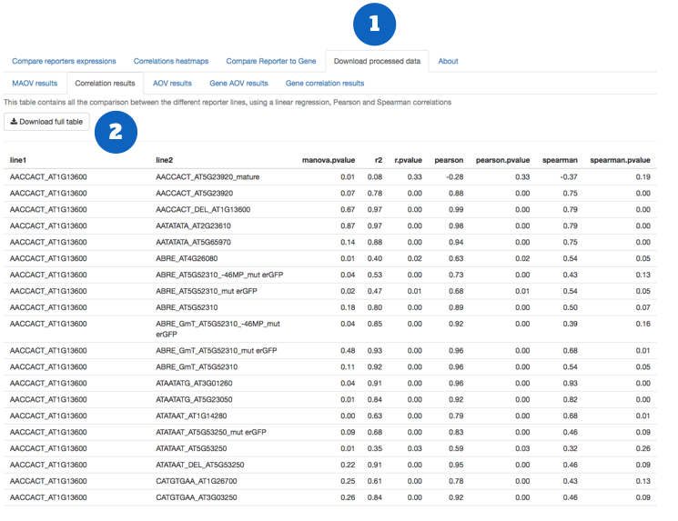

# Using PAGE-Root

[More information about PAGER](http://pageroot.github.io)

1. [Requirements](#requirements)
2. [CellSet2PAGER](#cellset2pager)
3. [PAGE-Root](#page-root)
	- [Load the data](#load-the-data)
	- [Choose the options](#choose-the-options)
	- [Compare two lines](#compare-two-lines)
	- [Explore correlations](#explore-correlations)
	- [Compare reporter to gene expression](#compare-reporter-to-gene-expression)
	- [Download the processed data](#download-the-processed-data)

---

<small>Overview of the PAGE-Root pipeline</small>

---

## CellSet2PAGER

The first step in the analysis is to transform the output data from CellSet into an RSML file that can be read by PAGE-Root. 

The CellSet data should be organised in separated Excell files, one per genotype. Each repetition of the genotype will be contained in a different sheet of the file. And example of CellSet output file can be [found here](/docs/cellset.xlsx). 

To process the CellSet data and compile then in a single RSML (Root System Markup Language) file, you can use the Cellset2Pager shiny app. The code the app is [available here](https://github.com/PAGERoot/CellSet-PAGER). 

To launch the app, enter the following command in your R console:

	library(shiny)
	shiny::runGitHub("PAGERoot/CellSet-PAGER", "PAGERoot") 

PAGE-Root accepts only specific cell types:

- columella
- cortex
- endodermis
- epidermis
- lateralrootcap
- QC
- stele

 Therefore, the CellSet2Pager app allows you to homogenize the names of the different cell types in your dataset. For each cell type, choose in the dropdown menu thet corresping cell type name in your data file. When you press `Update your data`, the name will be changed in your datafile. 

 Once all your celltypes are correct, you will be able to download the compiled RSML file. 

 > The easiest way is of course to use the correct cell types directly in CellSet.

## PAGE-Root

PAGER has two main functions: 

1. Comparing the expression of reporters between different lines or conditions
2. Comparing the expression of reporters with the correponding gene expression level (e.g. microarray data)

----

### Load the data

1. Upload the RSML file containing the CellSet data. [Example data file](/docs/reporter_example_small.rsml)

2. Upload the .csv file containing the microarray data. [Example data file](/docs/microarray_data_scaled.csv)
	- this file should have the following columns: `[Gene_ID][variable][value]`
	- `Gene_ID` : the ATG of the gene
	- `variable` : the name of the cell type
	- `value` : the expression value
	- the example datafile comes from the article from [Lee et al. 2006](http://dx.doi.org/10.1073/pnas.0510607103)

### Choose the options

3. Choose if you want to to use the absolute value (by default the values are standardized) and if you want to log2 transform your data. This applied only to the reporter data, not the gene data.

4. Choose which cell type to include in your analysis

5. Choose how to aggregate the data of each line / root / cell types

6. Press `Launch PAGE-Root` to start the analysis. Depending on how many line you have, this can take a couple of minutes. 

### Compare two lines

7. Choose the cell types to show in the output plots

8. Visualise the different between two lines (select them in the dropdown menu). For the visualisation, the values are normalised between 0 and 1, except if you choose to use absolute value in `3`

9. Overall statistic between the two lines. For the correlation, the first value is the one obtained with all the cell types selected in `5`. Second value is only for the cell types selected in `7`
	- MANOVA comparison (if p-value > 0.05 -> the two lines are significantly different)
	- linear regression
	- Pearson correlation
	- Spearman correlation

10. ANOVA comparison for each cell types between the two selected line

11. Visualisation of the reporter data
	- **Boxplot:** Boxplot of the reporter values for the different cell types
	- **Regression plot:** Regression of the cell types reporter valeus between the two cell types
	- **PCA plot:** Principal Comparison plot, highlighting the selected lines
	- **AOV results:** Result talbe of the ANOVAcomparison between the two lines

----

### Explore correlations

1. Choose the `Correlation heatmaps` tab

2. Choose the type of correlation you want to visualize

----

### Compare reporter to gene expression

1. Choose the `Compare Reporter to Gene` tab

2. Select the gene to visualize. The corresponding gene will automatically be selected in the `microarray dataset`.

3. Choose the cell types to show in the output plots

4. Overall statistic between the reporter and the gene expression. For the correlation, the first value is the one obtained with all the cell types selected in `1`. Second value is only for the cell types selected in `7`
	- linear regression
	- Pearson correlation
	- Spearman correlation

5. ANOVA comparison for each cell types between the two selected line

6. Visualisation of the reporter data
	- **Boxplot:** Boxplot of the reporter values for the different cell types
	- **Regression plot:** Regression of the cell types reporter valeus between the two cell types

----

### Download the processed data

1. Choose the `Download processed data` tab

2. Choose the type of data you want to downloas, in `.csv` format

[More information about PAGER](http://pageroot.github.io)

